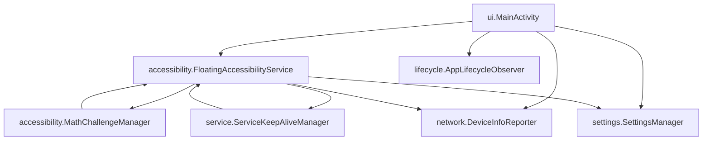

# 📁 包结构重构说明

## 🎯 重构目标

将原来所有类文件都在同一个包 `com.book.baisc` 中的结构，重构为按功能模块划分的清晰包结构。

## 📂 新的包结构

```
com.book.baisc/
├── ui/                     # 用户界面模块
│   └── MainActivity.java
├── accessibility/          # 无障碍服务模块
│   ├── FloatingAccessibilityService.java
│   └── MathChallengeManager.java
├── service/               # 后台服务模块
│   └── ServiceKeepAliveManager.java
├── settings/              # 设置管理模块
│   └── SettingsManager.java
├── network/               # 网络功能模块
│   └── DeviceInfoReporter.java
└── lifecycle/             # 生命周期模块
    └── AppLifecycleObserver.java
```

## 🔄 模块职责划分

### 1. ui 包 - 用户界面
- **MainActivity.java**: 主活动，处理用户交互界面
- 职责：权限检查、按钮事件处理、对话框显示等

### 2. accessibility 包 - 无障碍服务
- **FloatingAccessibilityService.java**: 核心无障碍服务
- **MathChallengeManager.java**: 数学题验证管理器
- 职责：小红书应用检测、悬浮窗管理、数学题验证

### 3. service 包 - 后台服务
- **ServiceKeepAliveManager.java**: 服务保活管理器
- 职责：系统广播监听、服务保活、定期检查

### 4. settings 包 - 设置管理
- **SettingsManager.java**: 应用设置管理器
- 职责：配置存储、时间间隔管理、默认设置

### 5. network 包 - 网络功能
- **DeviceInfoReporter.java**: 设备信息上报器
- 职责：设备信息收集、HTTPS上报、网络检查

### 6. lifecycle 包 - 生命周期
- **AppLifecycleObserver.java**: 应用生命周期观察器
- 职责：生命周期事件监听和处理

## 🛠️ 重构过程

### 1. 创建新包目录结构
```bash
mkdir -p app/src/main/java/com/book/baisc/{ui,accessibility,service,settings,network,lifecycle}
```

### 2. 移动文件并更新包声明
- 为每个类创建新文件，更新 `package` 声明
- 更新所有 `import` 语句引用新的包路径

### 3. 更新依赖关系

```java
// MainActivity 中的 import 更新

import com.book.baisc.floating.FloatService;
import com.book.baisc.lifecycle.AppLifecycleObserver;

// FloatingAccessibilityService 中的 import 更新
import com.book.baisc.lifecycle.ServiceKeepAliveManager;
import com.book.baisc.config.SettingsManager;
import com.book.baisc.network.DeviceInfoReporter;

// ServiceKeepAliveManager 中的 import 更新

```

### 4. 更新AndroidManifest.xml
```xml
<!-- MainActivity 路径更新 -->
<activity android:name=".ui.MainActivity" />

<!-- FloatingAccessibilityService 路径更新 -->
<service android:name=".accessibility.FloatingAccessibilityService" />
```

### 5. 删除原始文件
删除根包中的所有原始文件，避免重复

## ✅ 重构优势

### 1. 代码组织更清晰
- 按功能模块分组，职责单一
- 便于理解和维护代码结构

### 2. 降低耦合度
- 模块间依赖关系更明确
- 便于单独测试和修改

### 3. 扩展性更好
- 新功能可以按模块添加
- 支持团队协作开发

### 4. 维护成本降低
- 定位问题更快速
- 代码审查更高效

## 🔍 模块依赖关系



## 🚀 使用指南

### 1. 导入类时使用完整包路径

```java
// 正确方式

import com.book.baisc.config.SettingsManager;
import com.book.baisc.floating.FloatService;

// 避免使用 * 导入
import com.book.baisc.floating.*;
```

### 2. 新增功能时选择合适的包
- **UI 相关**: 放入 `ui` 包
- **无障碍功能**: 放入 `accessibility` 包
- **后台服务**: 放入 `service` 包
- **配置设置**: 放入 `settings` 包
- **网络相关**: 放入 `network` 包
- **生命周期**: 放入 `lifecycle` 包

### 3. 跨包调用时注意依赖关系
- 避免循环依赖
- 优先使用接口和回调
- 保持单向依赖

## 📋 注意事项

### 1. Android Studio 同步
重构完成后需要：
- Clean Project
- Rebuild Project
- 同步 Gradle 文件

### 2. 版本控制
建议将重构作为单独的提交，便于追踪变更

### 3. 测试验证
重构后需要全面测试：
- 编译是否成功
- 功能是否正常
- 性能是否受影响

## 🔧 故障排除

### 1. 编译错误
- 检查 import 语句是否正确
- 确认 AndroidManifest.xml 路径是否更新
- 验证包声明是否匹配目录结构

### 2. 运行时错误
- 检查反射调用的类路径
- 确认资源文件引用是否正确
- 验证服务注册路径

### 3. IDE 问题
- 重启 Android Studio
- 清理项目缓存
- 重新同步 Gradle

---

**重构完成日期**: 2025-01-08  
**重构版本**: v2.0  
**负责人**: AI Assistant 