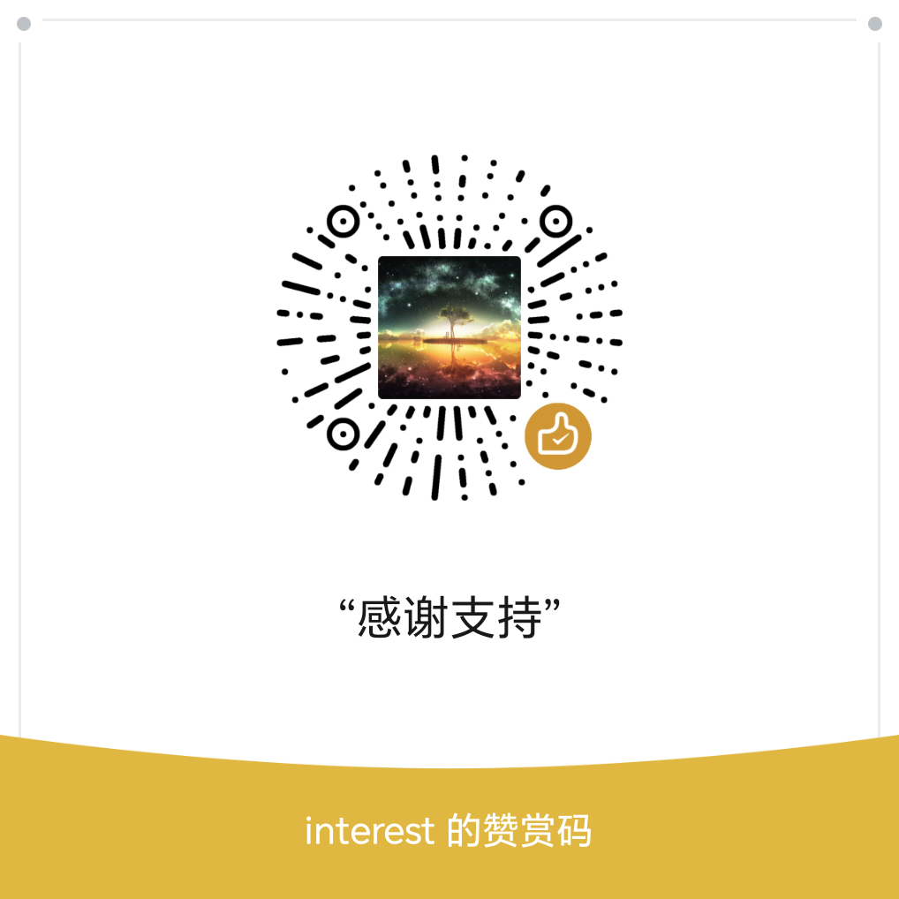

<div align="center">
  
  <h1>防沉迷提醒 APP</h1>
  <p><strong>用一层恰到好处的阻力，减少无意识刷推荐流。</strong></p>
  <p>
    <a href="https://developer.android.com/"></a>
    <a href="https://openjdk.org/"></a>
    <a href="./LICENSE"></a>
  </p>
</div>


## 项目简介

此 APP 对常见休闲 APP 用悬浮窗精细遮挡推荐内容，但搜索栏等其他菜单不做限制，即保留了“搜索引擎”的功能同时，规避了漫无目的的沉迷。 解除屏蔽通常需做一道难度适中的算术题或推理题。

## 功能亮点

- **精准屏蔽**：识别含关键词的目标页面，用适当大小悬浮窗精准遮挡，不影响搜索功能。

- **解题门槛**：支持答题解禁（算术题、推理题等），防沉迷之余亦可锻炼脑力。

- **个性定制**：悬浮窗警示语是基于用户定的目标、回答风格，调大模型得到；用户可配置自己的大模型渠道。

- **灵活可配**：
  1. 允许针对单个 APP：配置多个关键词，修改悬浮窗大小；
  2. 允许少量的免答题次数、时长，应对急需或纯休闲场景。
  3. 允许添加数量不限的其他 APP。
  
- **数据自主**：支持个人配置数据的导出与恢复。

- **开源透明**：APP 代码完全开源，apk 安装包未混淆加密，可确保无恶意行为。

## 获取与安装

### 下载 APK

从以下任一发布页下载最新的 `app-release.apk`，安装过程见页面的指引说明：

[GitHub Releases](https://github.com/interest2/anti-addiction/releases)，[Gitee Releases](https://gitee.com/interest2/anti-addiction/releases)

### 从源码构建

用 Android Studio 打开项目，配置 JDK 17 与 Android SDK 35 后即可构建。主要参数：Minimum SDK 24（Android 7.0）、Target/Compile SDK 35、Java 源码兼容级别 11。

## 主要原理

```text
包名变化
    ↓
无障碍服务读取当前应用与窗口内容
    ↓
匹配已启用的目标包名和关键词
    ↓
显示悬浮遮罩
    ↓
答对题目 → 临时关闭悬浮窗 → 到期后恢复遮挡
```

**检测频率**：由 APP 的切换、页面内容的变化来实时触发，另有 2 秒轮询兜底。

更多技术细节，可阅读此工程目录 0.docs 下的 md 文档，文件名以 AI- 开头的文件的内容主要由 AI 编写。

## 权限、隐私与联网说明

### 主要权限

| 权限 / 能力 | 用途 |
| --- | --- |
| 显示在其他应用上层 | 在目标页面显示遮罩和答题界面 |
| 无障碍服务 | 判断是否进入目标 APP、页面是否包含待屏蔽关键词 |
| 网络访问与网络状态 | 获取大模型提醒文字、题目、版本信息，并上报运行基础信息 |

### 当前版本网络行为

上报云端的信息：

- 基础信息：APP 版本号、AndroidID、型号等等（不包括通讯录、定位等等相对敏感的信息）。
- 用户定的目标：默认需发给云端才能调大模型；如果自定义了大模型则不会发送。

从云端获取的信息：

- 版本号、部分次要功能的开关。

**备注**：

1. APP 上所有链接均预置在 apk 中，杜绝从服务端获取而被篡改的风险。

2. 服务端代码出于安全考虑未开源，在自行部署或分发修改版前，应审查网络逻辑、替换服务端地址，并根据实际数据处理方式提供隐私政策。

## 技术栈

- Java 11
- AndroidX / Material Components
- AccessibilityService + WindowManager
- MMKV（本地配置存储）
- Gson（JSON 序列化）
- Gradle Version Catalog

##  请作者喝杯咖啡

如果这个项目对您有帮助，欢迎打赏支持

<br>
<b>微信赞赏</b>

## 许可证

本项目基于 [MIT License](./LICENSE) 开源。你可以使用、修改和分发本项目，但须保留原许可证与版权声明。
